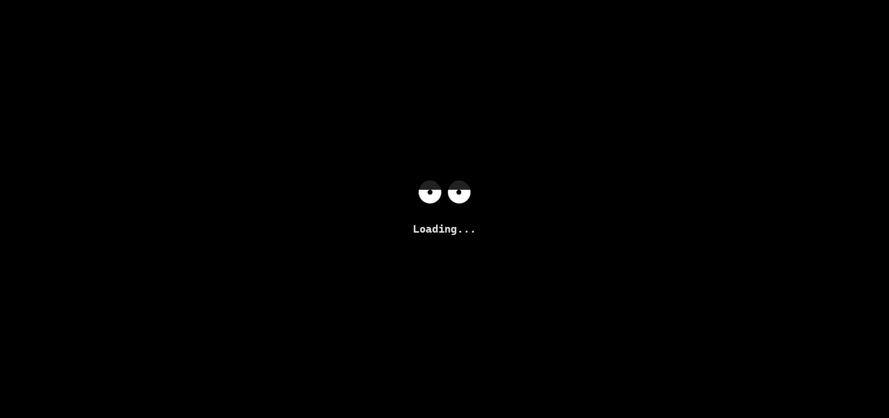
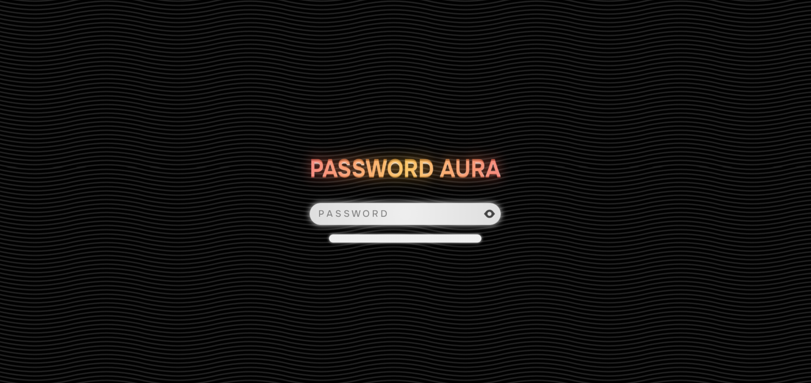

# P A S S W O R D - A U R A


**Una aplicación web interactiva que visualiza la fortaleza de contraseñas mediante efectos visuales dinámicos.**

## Instalación

**No se requiere servidor!** puedes abrir _**'public/index.html'**_ en tu navegador

```bash
git clone https://github.com/bugged-code/password-aura.git
cd password-aura
pnpm install # npm install or yarn install
pnpm dev
```

## Screenshots

<div style="display:flex;flex-wrap:wrap;justify-content:center;gap:24px">
  
  
</div>
